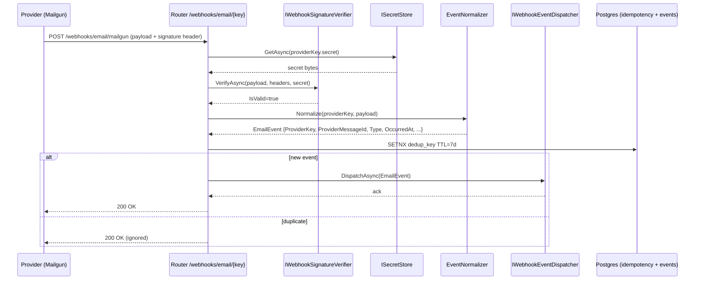

# Email Provider Abstraction Layer — Architecture

**Status:** Proposed
**Author:** Principal Engineer
**Date:** 2026-04-14
**Scope:** Decouple SendNex from AWS SES. Introduce a provider-agnostic abstraction supporting Mailgun today and `N` future providers without refactor.

---

## 1. Problem Statement

The SendNex platform is hard-coupled to AWS SES across outbound sending, domain identity / DKIM, inbound routing (SES → SNS → S3), and webhook signature verification. AWS has rejected our sandbox exit; we must migrate to Mailgun immediately. The next migration (Mailgun → SparkPost / Postmark / Resend) must be a **one-adapter-drop-in**, not a refactor.

### Current SES/SNS Coupling — Files to Refactor

Files that directly import `Amazon.*` SDK types (hard coupling):

| # | File | Concern |
|---|------|---------|
| 1 | `src/EaaS.Infrastructure/Services/SesEmailService.cs` | Outbound send + domain identity (SES v2 SDK) |
| 2 | `src/EaaS.Infrastructure/Services/S3InboundEmailStorage.cs` | Inbound raw-email storage (S3 SDK) |
| 3 | `src/EaaS.Infrastructure/DependencyInjection.cs` | `AddEmailProvider`, `AddInboundServices` wire SES/S3 clients |
| 4 | `src/EaaS.Infrastructure/Configuration/SesSettings.cs` | SES-shaped options |
| 5 | `src/EaaS.Infrastructure/EaaS.Infrastructure.csproj` | `AWSSDK.SimpleEmailV2` + `AWSSDK.S3` package references |
| 6 | `src/EaaS.Api/EaaS.Api.csproj` | AWS SDK transitive usage |
| 7 | `src/EaaS.Api/Program.cs` | SES client registration |
| 8 | `src/EaaS.Worker/Program.cs` | SES client registration |
| 9 | `src/EaaS.Worker/EaaS.Worker.csproj` | AWS SDK refs |

Files hard-coded to SNS (SES-adjacent webhook pipeline):

| # | File | Concern |
|---|------|---------|
| 10 | `src/EaaS.WebhookProcessor/Program.cs` | Routes `/webhooks/sns` and `/webhooks/sns/inbound` |
| 11 | `src/EaaS.WebhookProcessor/Handlers/SnsMessageHandler.cs` | SNS envelope dispatch |
| 12 | `src/EaaS.WebhookProcessor/Handlers/SnsInboundHandler.cs` | SNS inbound notification |
| 13 | `src/EaaS.WebhookProcessor/Handlers/SnsSignatureVerifier.cs` | AWS SNS signature verification |
| 14 | `src/EaaS.WebhookProcessor/Handlers/SnsValidation.cs` | AWS cert-URL validation |
| 15 | `src/EaaS.WebhookProcessor/Handlers/SnsMetrics.cs` | SNS-named metric labels |
| 16 | `src/EaaS.WebhookProcessor/Handlers/BounceHandler.cs` | Consumes SNS Bounce JSON |
| 17 | `src/EaaS.WebhookProcessor/Handlers/ComplaintHandler.cs` | Consumes SNS Complaint JSON |
| 18 | `src/EaaS.WebhookProcessor/Handlers/DeliveryHandler.cs` | Consumes SNS Delivery JSON |
| 19 | `src/EaaS.WebhookProcessor/Models/SnsModels.cs` | SES/SNS event record shapes |
| 20 | `src/EaaS.WebhookProcessor/Models/SnsInboundModels.cs` | SES inbound notification shapes |
| 21 | `src/EaaS.WebhookProcessor/Configuration/SnsWebhookOptions.cs` | SNS-shaped options |

Domain leakage:

| # | File | Concern |
|---|------|---------|
| 22 | `src/EaaS.Domain/Entities/Email.cs` | Has `SesMessageId` — must rename to provider-neutral `ProviderMessageId` |
| 23 | `src/EaaS.Infrastructure/Messaging/SendEmailConsumer.cs` | Sets `email.SesMessageId`; log messages reference SES |

**Refactor total: 23 files.**

---

## 2. Design Principles

| # | Principle | Enforcement |
|---|-----------|-------------|
| 1 | **No magic strings** | All literals in `EmailProviderConstants`; options bound via `IOptions<T>` / `IOptionsMonitor<T>`. |
| 2 | **SOLID — Interface Segregation** | `IEmailProvider`, `IDomainIdentityProvider`, `IInboundEmailSource`, `IWebhookSignatureVerifier` are separate — a provider can implement only what it supports. |
| 3 | **Open/Closed** | Adding a provider = new project `EaaS.Providers.{Name}` + one registration line. No edits to core. |
| 4 | **Dependency Inversion** | Application + Domain depend on abstractions in `EaaS.Domain.Providers`. Infrastructure adapters implement them. No provider SDK types cross the domain boundary. |
| 5 | **Liskov** | Every `IEmailProvider` passes the same contract test suite (§7). |
| 6 | **Adapter Pattern** | Existing SES code wrapped, not deleted (strangler fig). |
| 7 | **No vendor-shaped events** | Unified `EmailEventType` enum maps provider vocabulary (Mailgun `failed` + `permanent=true` → `PermFailed`); never leak Mailgun or SES enums. |

---

## 3. Interface Contracts

Location: new project `src/EaaS.Domain/Providers/` (abstractions) and `src/EaaS.Domain/Providers/Models/` (value types).

### 3.1 Provider Capability Descriptor

```csharp
namespace EaaS.Domain.Providers;

[Flags]
public enum EmailProviderCapability
{
    None                  = 0,
    SimpleSend            = 1 << 0,
    RawMimeSend           = 1 << 1,
    DomainIdentity        = 1 << 2,
    DkimManagement        = 1 << 3,
    InboundRouting        = 1 << 4,
    OpenTracking          = 1 << 5,
    ClickTracking         = 1 << 6,
    SuppressionSync       = 1 << 7,
    ScheduledSend         = 1 << 8,
    TemplateHosting       = 1 << 9,
    WebhookSignatureHmac  = 1 << 10,
    WebhookSignatureRsa   = 1 << 11
}

public sealed record EmailProviderDescriptor(
    string ProviderKey,                  // "ses", "mailgun", "sparkpost"
    string DisplayName,
    EmailProviderCapability Capabilities,
    Version AdapterVersion);
```

### 3.2 IEmailProvider

```csharp
namespace EaaS.Domain.Providers;

public interface IEmailProvider
{
    EmailProviderDescriptor Descriptor { get; }

    Task<SendEmailResult> SendAsync(
        SendEmailRequest request,
        CancellationToken cancellationToken = default);

    Task<SendEmailResult> SendRawAsync(
        SendRawEmailRequest request,
        CancellationToken cancellationToken = default);
}
```

### 3.3 IDomainIdentityProvider (split from IEmailProvider — ISP)

```csharp
namespace EaaS.Domain.Providers;

public interface IDomainIdentityProvider
{
    Task<DomainIdentityResult> CreateAsync(string domain, CancellationToken ct = default);
    Task<DomainVerificationResult> GetStatusAsync(string domain, CancellationToken ct = default);
    Task DeleteAsync(string domain, CancellationToken ct = default);
}
```

### 3.4 IEmailProviderFactory

```csharp
namespace EaaS.Domain.Providers;

public interface IEmailProviderFactory
{
    /// Resolve the outbound provider for a tenant, honouring per-tenant overrides,
    /// primary/secondary fallback, and global default.
    IEmailProvider GetForTenant(Guid tenantId);

    /// Resolve a specific provider by key — used by the webhook router
    /// when the route segment dictates which adapter must handle the payload.
    IEmailProvider GetByKey(string providerKey);

    /// Global default provider from configuration (cold-start / system emails).
    IEmailProvider GetDefault();

    /// Enumerates registered providers (for admin UI / health).
    IReadOnlyList<EmailProviderDescriptor> GetRegistered();
}
```

### 3.5 IWebhookSignatureVerifier

```csharp
namespace EaaS.Domain.Providers;

public readonly record struct WebhookVerificationResult(
    bool IsValid,
    string? FailureReason);

public interface IWebhookSignatureVerifier
{
    string ProviderKey { get; }

    Task<WebhookVerificationResult> VerifyAsync(
        ReadOnlyMemory<byte> payload,
        IReadOnlyDictionary<string, string> headers,
        IWebhookSecretAccessor secret,
        CancellationToken cancellationToken = default);
}

public interface IWebhookSecretAccessor
{
    /// Resolves the shared secret / cert URL for this provider+tenant.
    /// Pulls from ISecretStore, never from appsettings.json in production.
    ValueTask<ReadOnlyMemory<byte>> GetAsync(CancellationToken ct = default);
}
```

Signature verification is **mandatory**. There is no constructor, config key, or feature flag that makes it optional; a kill-switch exists only for operational emergencies and is audit-logged.

### 3.6 IInboundEmailHandler

```csharp
namespace EaaS.Domain.Providers;

public interface IInboundEmailSource
{
    string ProviderKey { get; }

    /// Parses a provider-shaped inbound payload into the domain model.
    /// Pulls MIME from provider-native storage (S3, Mailgun URL) via IInboundEmailStorage.
    Task<InboundEmail> ParseAsync(
        ReadOnlyMemory<byte> providerPayload,
        IReadOnlyDictionary<string, string> headers,
        CancellationToken cancellationToken = default);
}
```

### 3.7 Unified Event Model

```csharp
namespace EaaS.Domain.Providers;

public enum EmailEventType
{
    Accepted        = 0,   // accepted by provider, pre-delivery
    Delivered       = 1,
    Bounced         = 2,   // permanent bounce
    TempFailed      = 3,   // transient / deferred
    PermFailed      = 4,   // hard failure pre-delivery (rejected, policy)
    Complained      = 5,   // spam complaint
    Opened          = 6,
    Clicked         = 7,
    Unsubscribed    = 8,
    Stored          = 9    // inbound / provider-stored
}

public sealed record EmailEvent(
    string ProviderKey,
    string ProviderMessageId,
    EmailEventType Type,
    DateTimeOffset OccurredAt,
    string? Recipient,
    string? DiagnosticCode,
    IReadOnlyDictionary<string, string> ProviderMetadata);
```

### 3.8 Domain Request/Result Models (no SDK types)

```csharp
namespace EaaS.Domain.Providers;

public sealed record EmailAddress(string Address, string? DisplayName = null);

public sealed record EmailAttachment(
    string Filename,
    string ContentType,
    Stream Content,
    string? ContentId = null);

public sealed record SendEmailRequest(
    Guid TenantId,
    EmailAddress From,
    IReadOnlyList<EmailAddress> To,
    IReadOnlyList<EmailAddress>? Cc,
    IReadOnlyList<EmailAddress>? Bcc,
    string Subject,
    string? HtmlBody,
    string? TextBody,
    IReadOnlyList<EmailAttachment>? Attachments,
    IReadOnlyDictionary<string, string>? CustomHeaders,
    string? ConfigurationSetName,
    string? IdempotencyKey);

public sealed record SendRawEmailRequest(
    Guid TenantId,
    Stream MimeMessage,
    string? ConfigurationSetName,
    string? IdempotencyKey);

public sealed record SendEmailResult(
    bool Success,
    string? ProviderMessageId,
    string? ErrorCode,
    string? ErrorMessage,
    bool IsRetryable);
```

---

## 4. Configuration Shape

### 4.1 Strongly-Typed Options

```csharp
namespace EaaS.Domain.Providers.Configuration;

public sealed class EmailProviderOptions
{
    public const string SectionName = "EmailProviders";

    public string DefaultProviderKey { get; init; } = "mailgun";
    public string? SecondaryProviderKey { get; init; }       // Failover
    public bool EnableFailover { get; init; } = true;
    public IReadOnlyDictionary<string, ProviderAdapterOptions> Adapters { get; init; } = new Dictionary<string, ProviderAdapterOptions>();
}

public sealed class ProviderAdapterOptions
{
    public bool Enabled { get; init; } = true;
    public string? Region { get; init; }
    public string? ConfigurationSet { get; init; }
    public string? WebhookPath { get; init; }                // "/webhooks/email/mailgun"
    public string? SecretStoreKey { get; init; }             // pointer, NOT the secret
    public int MaxSendRatePerSecond { get; init; } = 14;
    public TimeSpan WebhookSignatureTolerance { get; init; } = TimeSpan.FromMinutes(5);
}
```

### 4.2 appsettings.json shape

```json
{
  "EmailProviders": {
    "DefaultProviderKey": "mailgun",
    "SecondaryProviderKey": "ses",
    "EnableFailover": true,
    "Adapters": {
      "ses":      { "Enabled": true, "Region": "eu-west-1", "SecretStoreKey": "email/ses/credentials", "WebhookPath": "/webhooks/email/ses" },
      "mailgun":  { "Enabled": true, "Region": "eu",        "SecretStoreKey": "email/mailgun/signing-key", "WebhookPath": "/webhooks/email/mailgun" }
    }
  }
}
```

### 4.3 Per-Tenant Provider Selection

New column on `tenants` table.

```sql
-- Migration: 20260420_AddTenantEmailProvider
ALTER TABLE tenants
  ADD COLUMN preferred_email_provider_key varchar(32) NULL,
  ADD COLUMN secondary_email_provider_key varchar(32) NULL;

CREATE INDEX ix_tenants_preferred_email_provider ON tenants(preferred_email_provider_key);
```

Resolution order in `EmailProviderFactory.GetForTenant`:
1. `tenant.preferred_email_provider_key` if set and adapter enabled → use it
2. `EmailProviderOptions.DefaultProviderKey`
3. If outbound send fails with `IsRetryable=false` and `EnableFailover`, fall through to `SecondaryProviderKey` **once** (circuit-break after 3 consecutive failures per tenant per 5-min window)

### 4.4 Provider Message ID column rename

```sql
-- Migration: 20260421_RenameSesMessageId
ALTER TABLE emails RENAME COLUMN ses_message_id TO provider_message_id;
ALTER TABLE emails ADD COLUMN provider_key varchar(32) NULL;
CREATE INDEX ix_emails_provider_key_msgid ON emails(provider_key, provider_message_id);
```

### 4.5 Secret Abstraction

```csharp
namespace EaaS.Domain.Providers;

public interface ISecretStore
{
    ValueTask<ReadOnlyMemory<byte>> GetBinaryAsync(string key, CancellationToken ct = default);
    ValueTask<string> GetStringAsync(string key, CancellationToken ct = default);
}
```

Concrete implementations (register one based on environment):
- `EnvironmentSecretStore` (dev / .env)
- `AwsSecretsManagerSecretStore`
- `AzureKeyVaultSecretStore`
- `VaultSecretStore` (HashiCorp)

---

## 5. Factory + Strategy Pattern

### 5.1 Registration DSL

```csharp
// Program.cs — Api, Worker, WebhookProcessor all use the same line
services
    .AddEmailProviders(builder.Configuration)
        .AddProvider<SesEmailProvider, SesWebhookSignatureVerifier, SesInboundEmailSource>("ses")
        .AddProvider<MailgunEmailProvider, MailgunWebhookSignatureVerifier, MailgunInboundEmailSource>("mailgun");
```

### 5.2 Factory Sketch

```csharp
internal sealed class EmailProviderFactory : IEmailProviderFactory
{
    private readonly IReadOnlyDictionary<string, IEmailProvider> _providers;  // keyed by ProviderKey
    private readonly ITenantProviderPreferenceRepository _tenantRepo;
    private readonly IOptionsMonitor<EmailProviderOptions> _options;
    private readonly IEmailProviderFailoverPolicy _failoverPolicy;

    public IEmailProvider GetForTenant(Guid tenantId)
    {
        var preferred = _tenantRepo.GetPreferredKey(tenantId);
        if (preferred is not null && _providers.TryGetValue(preferred, out var p) &&
            _failoverPolicy.IsHealthy(preferred, tenantId))
            return p;

        var defaultKey = _options.CurrentValue.DefaultProviderKey;
        return _providers[defaultKey];
    }

    public IEmailProvider GetByKey(string providerKey) => _providers[providerKey];
    public IEmailProvider GetDefault() => _providers[_options.CurrentValue.DefaultProviderKey];
    public IReadOnlyList<EmailProviderDescriptor> GetRegistered() =>
        _providers.Values.Select(v => v.Descriptor).ToList();
}
```

### 5.3 Adding a new provider (Open/Closed demo)

```csharp
// 1. New project: src/EaaS.Providers.SparkPost/
// 2. Implement IEmailProvider + IWebhookSignatureVerifier + IInboundEmailSource
// 3. In Program.cs — ONE line added:
.AddProvider<SparkPostEmailProvider, SparkPostSignatureVerifier, SparkPostInboundSource>("sparkpost");
// 4. Update appsettings "Adapters" — done. No core code changes.
```

---

## 6. Webhook Routing

### 6.1 New Endpoint Shape

```csharp
// WebhookProcessor/Program.cs
app.MapPost("/webhooks/email/{providerKey}",
    async (string providerKey,
           HttpContext ctx,
           IEmailProviderFactory factory,
           IWebhookSignatureVerifierResolver verifiers,
           IWebhookEventDispatcher dispatcher,
           CancellationToken ct) =>
    {
        var body = await ctx.ReadBoundedBodyAsync(maxBytes: 1_048_576, ct);
        var headers = ctx.Request.ExtractNormalizedHeaders();

        var verifier = verifiers.GetFor(providerKey);
        var secret   = await SecretAccessors.ForProvider(providerKey, ct);
        var result   = await verifier.VerifyAsync(body, headers, secret, ct);

        if (!result.IsValid)
            return Results.Unauthorized();

        await dispatcher.DispatchAsync(providerKey, body, headers, ct);
        return Results.Ok();
    });
```

### 6.2 Parallel Operation with SNS During Migration

- Existing routes `/webhooks/sns`, `/webhooks/sns/inbound` remain live
- New route `/webhooks/email/ses` behind the abstraction runs in parallel; both call into the same unified dispatcher
- SES webhook config stays pointed at SNS topics until Mailgun tenant cutover is 100% complete
- When tenant count on SES = 0, SNS routes are removed in a single PR (deprecation window: 2 sprints)

### 6.3 Signature Verification Is Non-Optional

Every adapter MUST implement `IWebhookSignatureVerifier`. The DI registration rejects providers that register a null verifier. A CI compile-time test enumerates registered adapters and asserts all three contracts (`IEmailProvider`, `IWebhookSignatureVerifier`, `IInboundEmailSource`) are wired.

---

## 7. Event Normalization

### 7.1 Mapping Table

| Unified `EmailEventType` | AWS SES/SNS event | Mailgun event | SparkPost event | Postmark |
|--------------------------|-------------------|---------------|-----------------|----------|
| `Accepted`               | `Send`            | `accepted`    | `injection`     | `Delivery` (pending) |
| `Delivered`              | `Delivery`        | `delivered`   | `delivery`      | `Delivery` |
| `Bounced`                | `Bounce` (`Permanent`) | `failed`+`severity=permanent` | `bounce` (`hard`) | `HardBounce` |
| `TempFailed`             | `Bounce` (`Transient`) | `failed`+`severity=temporary` | `delay`    | `SoftBounce` |
| `PermFailed`             | `Reject`          | `rejected`    | `policy_rejection` | `Blocked` |
| `Complained`             | `Complaint`       | `complained`  | `spam_complaint`| `SpamComplaint` |
| `Opened`                 | `Open`            | `opened`      | `open`          | `Open` |
| `Clicked`                | `Click`           | `clicked`     | `click`         | `Click` |
| `Unsubscribed`           | (custom link)     | `unsubscribed`| `list_unsubscribe` | `SubscriptionChange` |
| `Stored`                 | `ReceivedMail` (SES inbound) | `stored` | `relay_message`| `InboundReceived` |

### 7.2 Idempotency Key

```
dedup_key = SHA256(ProviderKey | ProviderMessageId | EventType | OccurredAt.UtcTicks)
```

Stored in Redis with TTL = 7 days (same as existing SNS dedup TTL). Duplicate events silently acked.

---

## 8. Migration Strategy (Strangler Fig)

```
Phase 0 — Prep          (Sprint 6.1)
  - Merge abstraction interfaces + EmailProviderFactory + secret store
  - Existing SES code wrapped in SesEmailProvider : IEmailProvider (adapter, no behaviour change)
  - All call sites switched from IEmailSender → IEmailProvider via factory
  - Tenants table migration (preferred_email_provider_key column)
  - SesEmailProvider wired as default; zero functional change in production

Phase 1 — Mailgun live  (Sprint 6.2)
  - MailgunEmailProvider + verifier + inbound source shipped
  - /webhooks/email/mailgun endpoint live
  - Admin dashboard exposes per-tenant provider selector
  - Internal test tenants flipped to Mailgun; metrics compared side-by-side

Phase 2 — Graduated cutover  (Sprint 6.3)
  - Tenant cohorts cut over in batches (5%, 25%, 50%, 100%)
  - Failover policy: if Mailgun circuit breaker opens, SES receives the send
  - Each batch observed for 48h before next

Phase 3 — SES decommission  (Sprint 6.4)
  - Confirm zero tenants on SES (excluding system/transactional fallback)
  - Remove /webhooks/sns* routes
  - Drop Amazon.SimpleEmailV2 + AWSSDK.S3 package refs
  - S3 inbound storage replaced with provider-agnostic IInboundEmailStorage
    (Mailgun Storage for now; S3 adapter retained as a storage option only)
```

Zero-downtime guarantee: at no point in Phases 0–2 is more than one provider active per tenant; routing decisions are pure config + DB state, not deploys.

---

## 9. Testing Strategy

### 9.1 Provider Contract Test Suite

One xUnit theory class, parameterised over every registered provider in integration tests:

```csharp
public abstract class EmailProviderContractTests<TProvider> where TProvider : IEmailProvider
{
    protected abstract TProvider CreateProvider();

    [Fact] public Task SendAsync_ValidRequest_ReturnsSuccess();
    [Fact] public Task SendAsync_InvalidRecipient_ReturnsRetryableFailure();
    [Fact] public Task SendRawAsync_WithAttachments_ReturnsSuccess();
    [Fact] public Task Descriptor_ReportsExpectedCapabilities();
    [Fact] public Task SendAsync_RespectsCancellation();
    [Fact] public Task SendAsync_IdempotencyKey_DeduplicatesProviderSide();
}

public sealed class SesEmailProviderContractTests      : EmailProviderContractTests<SesEmailProvider> { ... }
public sealed class MailgunEmailProviderContractTests  : EmailProviderContractTests<MailgunEmailProvider> { ... }
```

### 9.2 Fakes for Unit Tests

```csharp
public sealed class FakeEmailProvider : IEmailProvider
{
    public List<SendEmailRequest> Sent { get; } = new();
    public EmailProviderDescriptor Descriptor =>
        new("fake", "Fake", EmailProviderCapability.SimpleSend | EmailProviderCapability.RawMimeSend, new Version(1,0));

    public Task<SendEmailResult> SendAsync(SendEmailRequest req, CancellationToken ct = default)
    {
        Sent.Add(req);
        return Task.FromResult(new SendEmailResult(true, $"fake-{Guid.NewGuid():N}", null, null, false));
    }
    public Task<SendEmailResult> SendRawAsync(SendRawEmailRequest req, CancellationToken ct = default) => /* ... */;
}
```

### 9.3 Integration Harness

- `docker-compose.test.yml` adds:
  - `localstack` for SES/S3 emulation
  - `mailhog` + custom Mailgun webhook simulator container for Mailgun
- CI runs contract suite against both; failing either blocks merge.

---

## 10. Visual Diagrams

### 10.1 Current State (Tightly Coupled)

```
┌─────────────────────────────────────────────────────────────────────┐
│                          EaaS Worker                                │
│  ┌────────────────────┐         ┌──────────────────────┐            │
│  │  SendEmailConsumer │────────▶│   SesEmailService    │            │
│  │                    │ IEmail  │  uses Amazon.SES.v2  │            │
│  └────────────────────┘ Sender  └──────────┬───────────┘            │
└────────────────────────────────────────────┼────────────────────────┘
                                             │ AWS SDK
                                             ▼
                                    ┌──────────────────┐
                                    │     AWS SES      │
                                    └────────┬─────────┘
                                             │ events via SNS
                                             ▼
┌─────────────────────────────────────────────────────────────────────┐
│                     EaaS.WebhookProcessor                           │
│   /webhooks/sns ──▶ SnsSignatureVerifier ──▶ SnsMessageHandler      │
│                                               │                     │
│                      ┌────────────────────────┼──────────┐          │
│                      ▼                        ▼          ▼          │
│               BounceHandler          ComplaintHandler  DeliveryHdlr │
│               (SES JSON shape)       (SES JSON shape)  (SES shape)  │
└─────────────────────────────────────────────────────────────────────┘
```

### 10.2 Target State (Abstracted, Multi-Provider)

```
┌─────────────────────────────────────────────────────────────────────────┐
│                            EaaS Worker                                  │
│  ┌───────────────┐   IEmailProvider   ┌─────────────────────────────┐   │
│  │ SendEmailCons.│───────────────────▶│    IEmailProviderFactory    │   │
│  └───────────────┘ GetForTenant(id)   └─────────┬───────────────────┘   │
│                                                 │                       │
│            ┌────────────────────────────────────┼───────────────┐       │
│            ▼                                    ▼               ▼       │
│   ┌──────────────────┐            ┌──────────────────┐  ┌─────────────┐ │
│   │ SesEmailProvider │            │ MailgunEmailProv.│  │   Future    │ │
│   │ (adapter→SES v2) │            │  (adapter→Mailgn)│  │  SparkPost  │ │
│   └────────┬─────────┘            └────────┬─────────┘  └──────┬──────┘ │
└────────────┼───────────────────────────────┼───────────────────┼────────┘
             ▼                               ▼                   ▼
         AWS SES                         Mailgun API        SparkPost API

┌─────────────────────────────────────────────────────────────────────────┐
│                      EaaS.WebhookProcessor                              │
│                                                                         │
│  /webhooks/email/{providerKey}                                          │
│        │                                                                │
│        ▼                                                                │
│   IWebhookSignatureVerifierResolver ──▶ resolves by {providerKey}       │
│        │                                                                │
│        ▼                                                                │
│   IWebhookEventDispatcher ──▶ normalizes → EmailEvent (unified)         │
│        │                                                                │
│        ▼                                                                │
│   IEventSink (Bounce / Complaint / Delivery domain handlers —           │
│               provider-agnostic, consume EmailEvent only)               │
└─────────────────────────────────────────────────────────────────────────┘
```

### 10.3 Webhook Sequence



### 10.4 Class Diagram

```
                            ┌──────────────────────────────┐
                            │   IEmailProviderFactory      │
                            ├──────────────────────────────┤
                            │ +GetForTenant(id)            │
                            │ +GetByKey(key)               │
                            │ +GetDefault()                │
                            │ +GetRegistered()             │
                            └───────────────┬──────────────┘
                                            │ returns
                                            ▼
 ┌────────────────────────────┐   ┌────────────────────────────────┐
 │  IDomainIdentityProvider   │   │        IEmailProvider          │
 ├────────────────────────────┤   ├────────────────────────────────┤
 │ +CreateAsync(domain)       │   │ +Descriptor : Descriptor       │
 │ +GetStatusAsync(domain)    │   │ +SendAsync(req)                │
 │ +DeleteAsync(domain)       │   │ +SendRawAsync(req)             │
 └────────────┬───────────────┘   └──────────────┬─────────────────┘
              │                                  │
              │ implemented by                   │
              ▼                                  ▼
   ┌────────────────────────┐     ┌──────────────────────────────────┐
   │  SesEmailProvider      │     │   MailgunEmailProvider           │
   │  (wraps AWS SDK v2)    │     │   (HttpClient + Mailgun REST)    │
   │  impls IEmailProvider, │     │   impls IEmailProvider,          │
   │       IDomainIdentity  │     │        IDomainIdentityProvider   │
   └────────────────────────┘     └──────────────────────────────────┘

        ┌───────────────────────────┐   ┌──────────────────────────────┐
        │ IWebhookSignatureVerifier │   │     IInboundEmailSource      │
        │  +VerifyAsync(..)         │   │     +ParseAsync(..)          │
        └────────────┬──────────────┘   └──────────────┬───────────────┘
                     │                                 │
             ┌───────┴────────┐                ┌───────┴────────┐
             ▼                ▼                ▼                ▼
     SesSignatureVer.   MailgunSigVer.   SesInboundSource   MailgunInbSrc
```

---

## 11. Design Decisions (ADR-flavoured)

| ID | Decision | Rationale | Trade-off |
|----|----------|-----------|-----------|
| D-01 | Interfaces live in `EaaS.Domain.Providers`, adapters in separate `EaaS.Providers.{Name}` projects | Enforces DIP at the csproj boundary; AWS SDK cannot transit into Domain | More projects to manage |
| D-02 | `IEmailProvider` and `IDomainIdentityProvider` separate | ISP; Mailgun domain mgmt differs from SES enough to warrant split | Slightly more DI plumbing |
| D-03 | Webhooks routed by `{providerKey}` path segment, not header or host | Makes provider obvious in logs, simple SSRF analysis, works with existing SSRF guard | Cannot serve multiple hosts per provider |
| D-04 | Idempotency key = SHA256 of provider+msgid+type+timestamp | Works uniformly across providers; Mailgun & SES both deliver duplicate events | TTL tuning required |
| D-05 | Failover is per-tenant circuit-broken, not global | One misbehaving tenant shouldn't trip the whole fleet | More complex state |
| D-06 | Secrets resolved at send time via `ISecretStore`, not at startup | Rotation without restart; required for tenant-byo-credentials later | One extra async hop per send (cached) |
| D-07 | Rename `ses_message_id` → `provider_message_id` + new `provider_key` column | Eliminates vendor name from domain model | Migration touches hot table; zero-downtime rename via shadow column + backfill |
| D-08 | Keep SNS pipeline live in parallel during migration | Avoids big-bang cutover risk | Doubled code paths for 2 sprints |
| D-09 | Signature verification is mandatory, with kill-switch for ops emergencies only | Security floor; any provider without HMAC/RSA is not acceptable | None meaningful |
| D-10 | Inbound storage abstracted behind `IInboundEmailStorage` | Mailgun stores in its own system until fetched; S3 is just one backend | Slight re-shape of existing S3 code |

---

## 12. Out of Scope

- Rate-limiting at provider-selection time (handled by existing `IRateLimiter`)
- Admin UI for provider selection (separate UX spec)
- Cost-optimized provider routing (future: plan-aware provider selection)
- Multi-region provider failover
